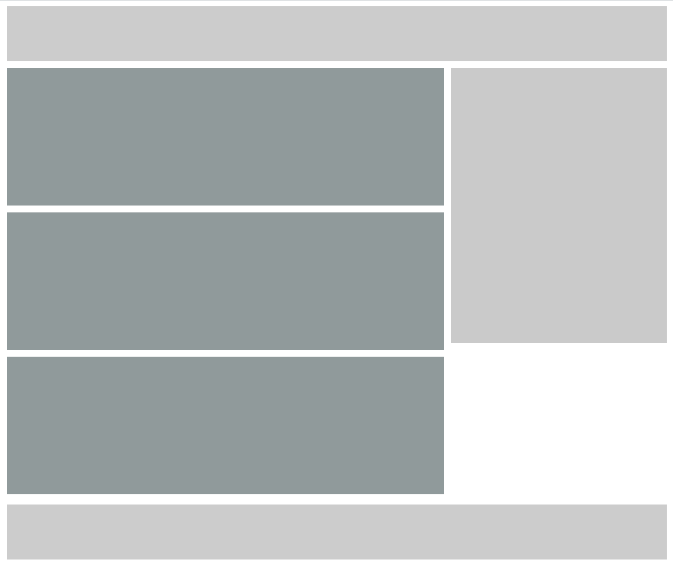

# my-library-core
this is a library of react components and other useful functions for development

## installation

### npm
```bash
npm install my-library-core --save
```
### yarn 
```bash
yarn add my-library-core
```
## demo
    this is little example of one of the components
```jsx
import {
    Box as Wrapper,
    Box as Header,
    Box as Main,
    Box as Aside,
    Box as Footer,
    Box
} from '../lib/components'

function App() {
  const style = {h: '500px'}
  return (
    <Wrapper 
        grid
        gap="10px"
        type="lg" 
        cols="1fr 1fr 1fr" 
        y="start"
        myStyle={{ai: 'start'}}
        areas="
            'header header header'
            'main main aside'
            'footer footer footer'
        "
      >
        <Header header h='80px' bg="#ccc" span="header"/>
        <Main main flex wrap span="main">
          <Box  h='200px' bg="#909A9B" m="0 0 5px 0"/>
          <Box  h='200px' bg="#909A9B" m="5px 0"/>
          <Box  h='200px' bg="#909A9B" m="5px 0"/>
        </Main>
        <Aside aside h='400px'bg="#CACACA" m="0" span="aside"/>
        <Footer footer h='80px'bg="#ccc" span="footer"/>
    </Wrapper>
  )
}

export default App
```
and result will be this:



## overview
this project has the following:
dependencies:
    <b>styled-components</b>
components: 
    <b>Box</b>
    <b>Card</b>
    <b>Modal</b>
    <b>MyBtn</b>
    <b>Navbar</b>
functions: 
    <b>customizer</b>
const: 
    <b>Breakpoints</b>
    <b>Layers</b>
    <b>LayersBootstrap</b>
    <b>MyColors</b>
    <b>MyThemeColors</b>
provider:
    <b>MyContext</b>